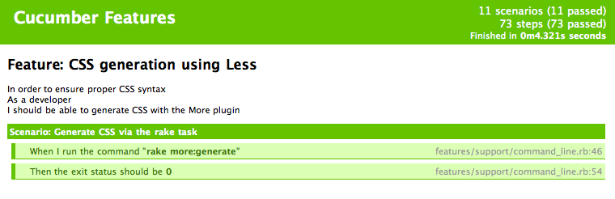

!SLIDE bullets incremental
# Cucumber Tips and Tricks
* Knowing Cucumber is good
* Abusing Cucumber is better

!SLIDE smaller
# HTML output
    cucumber --format html --out ~/Desktop/todo-features.html

!SLIDE center

!SLIDE smaller
# Tagged scenarios
    @wip
    Scenario: Create a new todo
      When I go to the new todo page
      And I fill in "Title" with "My new todo"
      And I press "Create"
      Then I should be on the homepage
      And I should see "My new todo"

    cucumber --tags @tagname
    rake cucumber:wip == cucumber --tags @wip
    rake cucumber:ok == cucumber --tags ~@wip

!SLIDE smaller
# Transform

    @@@ ruby
    Transform /^the todo "(.+)"$/ do |title| <==
      Todo.where(:title => title).last
    end

    Then %{$todo should be complete} do |todo| <==
      todo.should be_complete
    end

    Scenario: Flag a todo as complete
      Given I have a todo titled "Go to grocery store"
      When I go to the homepage
      And I press "Complete"
      Then the todo "Go to grocery store" should be complete <==

!SLIDE smaller
# Timecop
    @@@ ruby
    # features/step_definitions/time_steps.rb

    When /^(\d+) days? go|goes by$/ do |count|
      Timecop.travel(count.to_i.day.from_now)
    end

    Given %{today is "$date"} do |date|
      date = DateTime.parse(date)
      Timecop.travel(date)
    end

    Before { Timecop.freeze(Time.now) }
    After  { Timecop.return }
